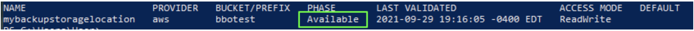
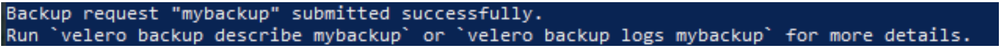
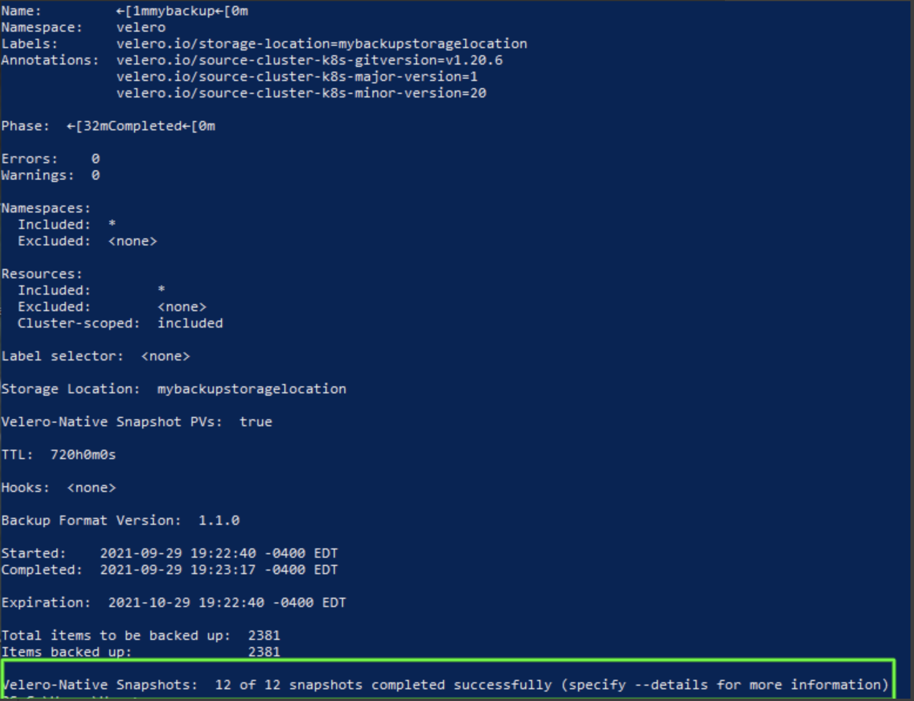
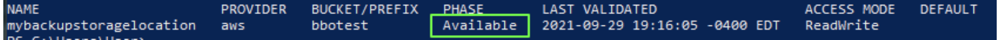

# **Namespace Backup and restore**

In this example, we'll backup a single namespace, and restore that same namespace. The example will the Velero CLI but can also be done with YAML and helm.

This assumes you have a properly configured storage location that Velero will use. You can check this using: 

`velero backup-location get`

The result should say `phase:Available`, if it doesn't you'll need to refer to documentation to configure you're particular storage.

This next command does a backup in the namespace of mynamespace , includes cluster resources and persistent volume snapshot and uses a backup configuration of mybackupstoragelocation.

`velero backup create mybackup --snapshot-volumes --include-cluster-resources --include-namespaces mynamespace --storage-location mybackupstoragelocation `

 (nb: a * will backup all namespaces) , (the storage-location is default if left blank)

 You can check the status of the backup, using the command

`velero backup describe mybackup`  

You'll notice Velero adds a date-time stamp '20210927145634' to your backup name

### **Restore a single namespace** 

In this example we'll restore the namespace we just backed up to a new empty cluster you have already setup.

The new cluster must be exactly the same version of Kubernetes, Velero, and Helm with the same configuration as the backup cluster.
Velero should already be installed in the new cluster pointing to the same backup location as the backed up cluster. 

You should be able to see the backup you wish to restore by running this command in the context of the new cluster

`velero backup get`

To restore the namespace mynamespace along with the persistent volume(s) you would use this command:

`velero restore create myrestore  --from-backup mynamespace20210927163457 --include-namespaces mynamespace`  

(nb: a * will restore all namespaces)

You will be able to see the progress of the restore once it has been successfully queued with this command

`velero restore describe myrestore`   

Note: To troubleshoot a restore use the logs from this command and this [help](https://velero.io/docs/v1.6/debugging-restores/) page from the Velero docs. 

`velero restore logs myrestore`

